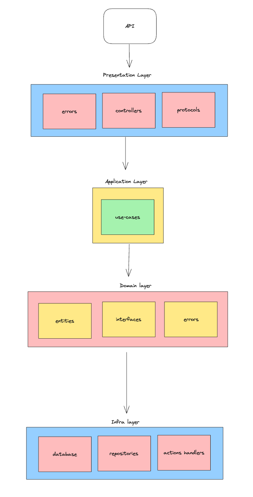
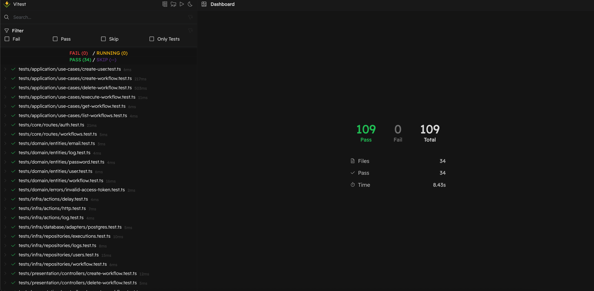

[](https://github.com/CaioAugustoo/alloy-challenge/actions/workflows/ci.yml)

**Workflow Automation API**

A Node.js API for building and executing basic workflow automations, allowing users to define workflows composed of triggers and actions. This project follows Clean Architecture and Domain-Driven Design (DDD) principles for maintainability and scalability.

---

## Table of Contents

- [Overview](#overview)
- [Features](#features)
- [Architecture](#architecture)
- [Tech Stack](#tech-stack)
- [Folder Structure](#folder-structure)
- [The algorithm](#the-algorithm)
- [Prerequisites](#prerequisites)
- [Installation](#installation)
- [Running the Application](#running-the-application)
- [Endpoints](#endpoints)
- [Testing](#testing)
- [Tradeoffs](#tradeoffs)
- [Contributing](#contributing)
- [Tradeoffs](#tradeoffs)
- [Possible next steps](#possible-next-steps)

---

## Overview

This project implements a basic workflow automation system where users can:

- Define **workflows** made of **triggers** and **actions**
- Support a limited set of triggers (e.g., time-based schedules, webhook events)
- Support a limited set of actions (e.g., sending HTTP requests, logging messages)

The API exposes endpoints to create, list, update, and execute workflows programmatically.

---

## Features

- **Workflow Definition:** Create workflows to orchestrate actions.

- **Actions:**

  - Send HTTP requests to external services
  - Log custom messages
  - Delay

- **Execution Engine:** Process triggers and execute associated actions in sequence. The state is persisted for each execution.
- **Error Handling:** Retries and logging for failed actions with customizable backoff.

---

## Architecture

The project follows **Clean Architecture** and **Domain-Driven Design (DDD)**:

1. **Presentation Layer (API):** Handles HTTP requests and responses (Express controllers, request/response DTOs).
2. **Application Layer:** Contains use cases (interactors) orchestrating domain operations without framework dependencies.
3. **Domain Layer:** Business entities, value objects, and domain services. Encapsulates core business logic.
4. **Infrastructure Layer:** Implementation details (database repositories, HTTP clients).

This separation ensures high cohesion, testability, and flexibility to swap implementations.

Down below is a high-level overview of the application architecture.



---

## Tech Stack

- **Runtime:** Node.js
- **Language:** TypeScript
- **Framework:** Express.js
- **Database:** PostgreSQL
- **Testing:** Vitest (Unit & Integration)
- **Containerization:** Docker & Docker Compose

---

## Folder Structure

```

├── src
│ ├── core
│ ├── domain
│ ├── application
│ ├── infrastructure
│ └── presentation
│ └── shared
├── tests
├── migrations
├── docker-compose.yaml
├── Dockerfile
├── tsconfig.json
└── README.md

```

- **core/**: Core for the application, including server, routes, middlewares, and adapters
- **domain/**: Entities, value objects, aggregates, domain events
- **application/**: Use cases and interfaces for repositories
- **infrastructure/**: Database, HTTP clients, scheduling adapters
- **presentation/**: Express routes, controllers, middlewares
- **shared/**: Helpers, protocols, and abstractions

---

## The algorithm

The algorithm processes triggers and executes actions in sequence. Given an input, the algorithm:

1. Run through the list of actions in the workflow.
2. For each action there is a handler that executes the action (e.g., HTTP request, log message).
3. If an action fails, the algorithm retries it with exponential backoff. **This can be configured in the workflow.**
4. If the action succeeds, the algorithm moves to the next action.
5. If all actions fail, the workflow fails (when the retry limit is reached).

For each action a log is created with the following structure:

```json
{
  "id": "uuid",
  "workflowId": "uuid",
  "executionId": "uuid",
  "actionId": "uuid",
  "status": "success | failed",
  "attempt": 1,
  "message": "optional",
  "createdAt": "2023-01-01T00:00:00.000Z"
}
```

Users can resume from last execution by providing the `executionId` in the request body. For example:

```json
{
  "workflowId": "uuid",
  "executionId": "uuid",
  "maxRetries": 3,
  "backoffBaseMs": 500
}
```

The algorithm will retry the failed action with exponential backoff until the `maxRetries` limit is reached.

---

### Prerequisites

- Node.js ≥ 18
- Docker & Docker Compose
- npm or yarn

### Installation

1. Clone the repository:

   ```bash
   git clone https://github.com/CaioAugustoo/alloy-challenge.git
   cd alloy-challenge
   ```

2. Install dependencies

   ```
   npm install
   ```

---

## Running the Application

### With Docker Compose

```bash
docker-compose up --build -d
```

**If you face some cache issues with Docker, try to export this env var:**

`export DOCKER_DEFAULT_PLATFORM= && docker-compose up --build -d`

The API will be available at `http://localhost:3000`. Also a postgres database will be available at `localhost:5432`.

---

## Endpoints

This project is a REST API built with Express.js. Endpoints are defined in the `src/core/routes` directory.

The API uses JWT authentication except for the `/signup` endpoint. The `/signup` endpoint is used to register new users.

**The focus of this project is on the workflow automation, so the API is designed to handle workflows and their executions and not to provide a complete CRUD API for users, workflows, and actions, even though it would be nice to have in the future.**

#### POST /signup

Register a new user.

**Curl Example**

```bash
curl --request POST \
  --url http://localhost:3000/signup \
  --header 'Content-Type: application/json' \
  --data '{
	"name": "caio augusto",
	"email": "caioamfr@gmail.com",
	"password": "12345677"
}'
```

The response will contain the access token.

```json
{
  "accessToken": "..."
}
```

**PS:** The access token is valid for one day and it must be used to authenticate requests to the API.

---

#### POST /workflows

Create a new workflow.

**PS:** The access token must be provided in the request header.

**Curl Example**

```bash
curl --request POST \
  --url http://localhost:3000/workflows \
  --header 'Content-Type: application/json' \
  --header 'access-token: <YOUR TOKEN FROM SIGNUP ENDPOINT>' \
  --data '{
	"triggerType": "webhook",
	"actions": [
		{
			"action_id": "a1",
			"type": "log",
			"params": {
				"message": "Start!"
			},
			"next_ids": [
				"a2"
			]
		},
		{
			"action_id": "a2",
			"type": "delay",
			"params": {
				"ms": 1000
			},
			"next_ids": [
				"a3"
			]
		},
		{
			"action_id": "a3",
			"type": "http",
			"params": {
				"url": "https://example.com"
			}
		},
		{
			"action_id": "a4",
			"type": "http",
			"params": {
				"url": "https://google.com"
			}
		}
	]
}'
```

The response will contain the workflow id.

```json
{
  "workflowId": "uuid"
}
```

---

#### POST /workflows/:workflowId/executions

Execute a workflow.

**PS:** The access token must be provided in the request header.

**Curl Example**

```bash
curl --request POST \
  --url http://localhost:3000/workflows/81a8b0a9-36a6-468c-b980-14561d452e0a/executions \
  --header 'Content-Type: application/json' \
  --header 'access-token: <YOUR TOKEN FROM SIGNUP ENDPOINT>' \
  --data '{
	"maxRetries": 3,
	"backoffBaseMs": 1000
}'
```

_You can customize the retry behavior by providing the `maxRetries` and `backoffBaseMs` in the request body._

The response will contain information about the ran workflow.

```json
{
  "workflowId": "81a8b0a9-36a6-468c-b980-14561d452e0a",
  "executionId": "c48e465e-f619-4fb5-996b-395e92974976",
  "completed": true, // workflow completed successfully
  "retries": {
    "a1": 0, // a1 node failed 0 times
    "a2": 0, // a2 node failed 0 times
    "a3": 0 // a3 node failed 0 times
  },
  "startedAt": "2025-06-26T14:09:32.953Z",
  "updatedAt": "2025-06-26T14:09:34.708Z"
}
```

When workflow execution fails, you can retry it by providing the `executionId` in the request body.

**Curl Example**

```bash
curl --request POST \
  --url http://localhost:3000/workflows/81a8b0a9-36a6-468c-b980-14561d452e0a/executions \
  --header 'Content-Type: application/json' \
  --header 'access-token: <YOUR TOKEN FROM SIGNUP ENDPOINT>' \
  --data '{
	"maxRetries": 3,
	"backoffBaseMs": 1000,
	"executionId": "3e391b4d-2d42-46e9-8ef6-c9c275396ad3"
}'
```

In this case, the algorithm will retry the failed action with exponential backoff until the `maxRetries` limit is reached starting from the last failed action, allowing the user to resume from the last execution.

---

#### GET /workflows/:workflowId

Get a workflow by id.

**PS:** The access token must be provided in the request header.

```bash
curl --request GET \
  --url http://localhost:3000/workflows/b399904f-f256-4419-ac62-d829f5ef60d2 \
  --header 'access-token: <YOUR TOKEN FROM SIGNUP ENDPOINT>'
```

The response will contain the workflow.

```json
{
  "workflow": {
    "id": "b399904f-f256-4419-ac62-d829f5ef60d2",
    "triggerType": "webhook",
    "createdAt": "2025-06-26T12:00:50.168Z",
    "updatedAt": "2025-06-26T12:00:50.168Z",
    "actions": {
      ...
    }
  }
}
```

---

#### GET /workflows

List all workflows.

**PS:** The access token must be provided in the request header.

**Curl Example**

```bash
curl --request GET \
  --url http://localhost:3000/workflows \
  --header 'access-token: <YOUR TOKEN FROM SIGNUP ENDPOINT>'
```

The response will contain an array of workflows.

```json
{
  "workflows": [
    {
      "id": "b960f596-971b-4be9-98c2-77ef13e45700",
      "trigger_type": "webhook",
      "created_by": "0e35731d-021f-47d6-b73b-4262af0e82b6",
      "created_at": "2025-06-26T14:08:52.374Z",
      "updated_at": "2025-06-26T14:08:52.374Z"
    },
    {
      "id": "81a8b0a9-36a6-468c-b980-14561d452e0a",
      "trigger_type": "webhook",
      "created_by": "0e35731d-021f-47d6-b73b-4262af0e82b6",
      "created_at": "2025-06-26T14:09:14.105Z",
      "updated_at": "2025-06-26T14:09:14.105Z"
    }
  ]
}
```

---

## Testing

Run unit and integration tests with coverage:

```bash
npm test
```

To run tests in watch mode (UI):

```bash
npm run test:ui
```

All tests are located in the `tests` directory, and the coverage report is available in the `coverage` directory.



---

## Tradeoffs

This project is a learning exercise and a way to practice my skills in software development. I put a lot of effort into making it as simple and straightforward as possible, but I also wanted to explore some advanced concepts and technologies like TypeScript, Domain-Driven Design (DDD), and Clean Architecture.

I didn't have time to implement all the features I wanted to, so I focused on the core functionality and the algorithm.

Some tradeoffs I faced:

- Clean architecture: I used Clean Architecture to separate the core logic from the infrastructure and the presentation layer. This allowed me to focus on the core functionality and the algorithm without getting distracted by the infrastructure details. Clean architecture is a great choice for projects that require a high level of separation of concerns, but it can be a bit overwhelming for smaller projects like this one.

- Database: I used Postgres as the database, but I could have used a different database like MongoDB or MySQL. The choice of database right here is personal preference, because I work with Postgres a lot.

---

## Possible next steps

As I mentioned earlier, this project is a learning exercise and a way to practice my skills in software development, this is why I didn't implement all the features I wanted to. Here are some possible next steps:

- Add more features like support for more triggers and actions
- Add swagger documentation
- More CRUD operations for users, workflows, and actions
- UI for creating and managing workflows
  ...

---

## Contributing

1. Fork the repository
2. Create a feature branch: `git checkout -b feature/YourFeature`
3. Commit your changes: `git commit -m "feat: describe your feature"`
4. Push to the branch: `git push origin feature/YourFeature`
5. Open a Pull Request

Please follow conventional commits and write descriptive commit messages.
