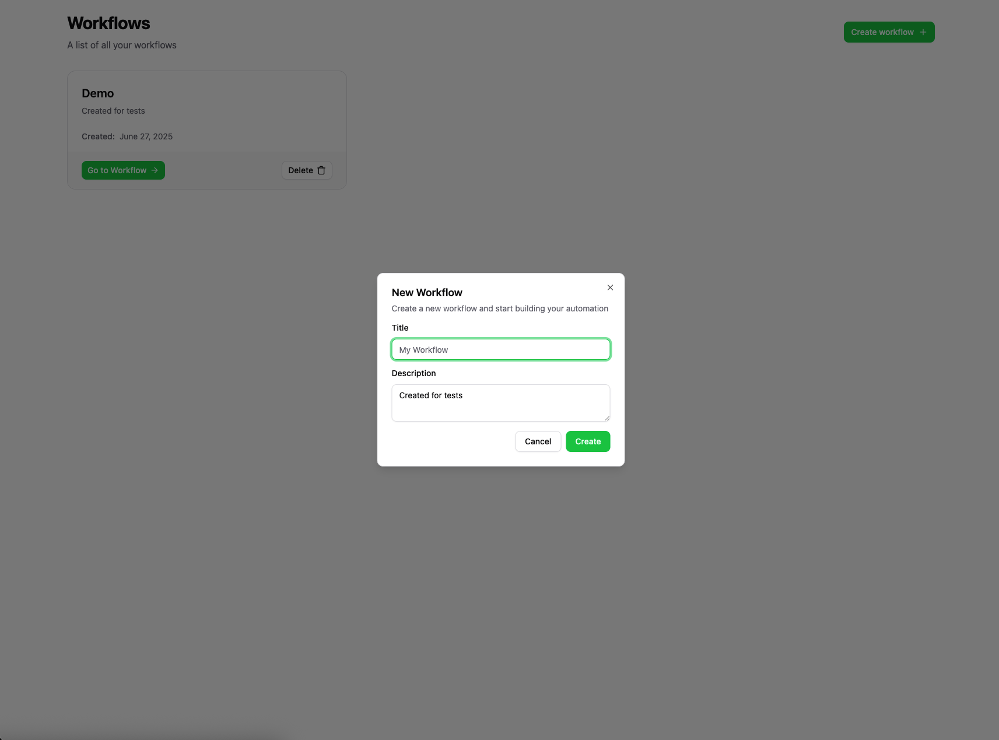
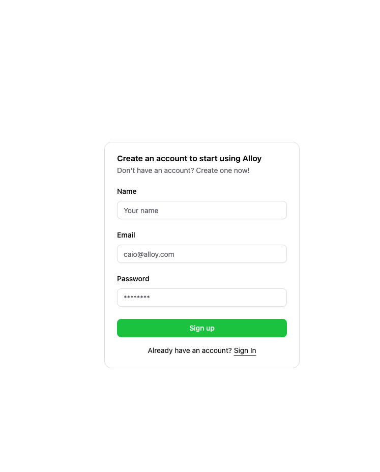

**Workflow Automation UI**

A React.js UI for building and executing basic workflow automations, allowing users to define workflows composed of triggers and actions.

This project was not challenged to be built, but I decided to build it anyway because I liked a lot this challenge!

---

## Table of Contents

- [Overview](#overview)
- [Features](#features)
- [Tech Stack](#tech-stack)
- [Folder Structure](#folder-structure)
- [Running the Application](#running-the-application)
- [Screenshots](#screenshots)
- [Contributing](#contributing)
- [Testing](#testing)

---

## Overview

This project is a React.js UI for building and executing basic workflow automations, allowing users to define workflows composed of triggers and actions.

---

### Features

The project consists of two main features:

- Workflow Builder: A visual editor for building workflows.
- Auth: A login and registration system for users.

---

## Tech Stack

The project uses the following technologies:

- React.js: A JavaScript library for building user interfaces.
- Tailwind CSS: A utility-first CSS framework for styling.
- TypeScript: A superset of JavaScript that adds static typing.

---

### Folder Structure

```

├── src
│ ├── components
│ ├── features
│ ├── lib
│ ├── routes.tsx
│ ├── services
│ ├── utils
│ └── index.tsx
├── tailwind.config.js
├── tsconfig.json
└── vite.config.ts

```

- **components/**: Reusable React components.
- **features/**: The main features of the application, including the workflow builder and the auth system.
- **lib/**: Third-party libraries and utilities.
- **services/**: Services for interacting with the backend API.
- **utils/**: Utility functions and types.
- **index.tsx**: The entry point of the application.
- **tailwind.config.js**: Tailwind CSS configuration.
- **tsconfig.json**: TypeScript configuration.
- **vite.config.ts**: Vite configuration.

### Prerequisites

- Node.js ≥ 22
- Docker & Docker Compose
- npm or yarn

---

### Installation

1. Clone the repository:

   ```bash
   git clone https://github.com/CaioAugustoo/alloy-challenge.git
   cd alloy-challenge && cd client
   ```

2. Install dependencies

   ```
   npm install
   ```

3. Run the application

   ```
   npm run dev
   ```

   The UI will be available at `http://localhost:5173`.

---

### Screenshots

Here are some screenshots of the application:


---



---


---


---



---

## Contributing

1. Fork the repository
2. Create a feature branch: `git checkout -b feature/YourFeature`
3. Commit your changes: `git commit -m "feat: describe your feature"`
4. Push to the branch: `git push origin feature/YourFeature`
5. Open a Pull Request

Please follow conventional commits and write descriptive commit messages.

---

## Testing

Because of this project is a bonus challenge, I didn't implement any tests for it. But it would be great to have some tests, so I'm open to any contribution to improve the test coverage.
